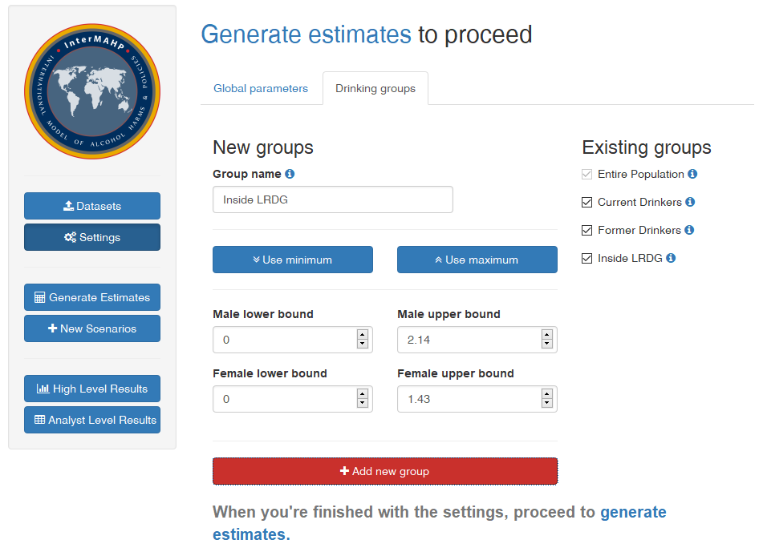
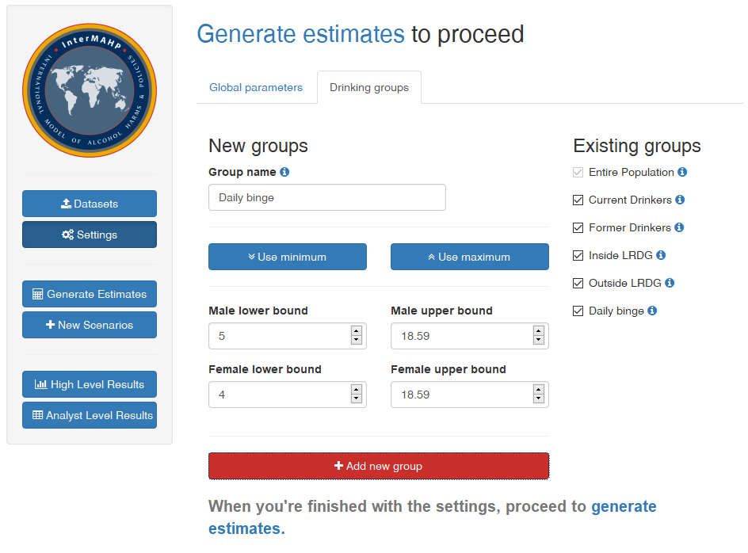
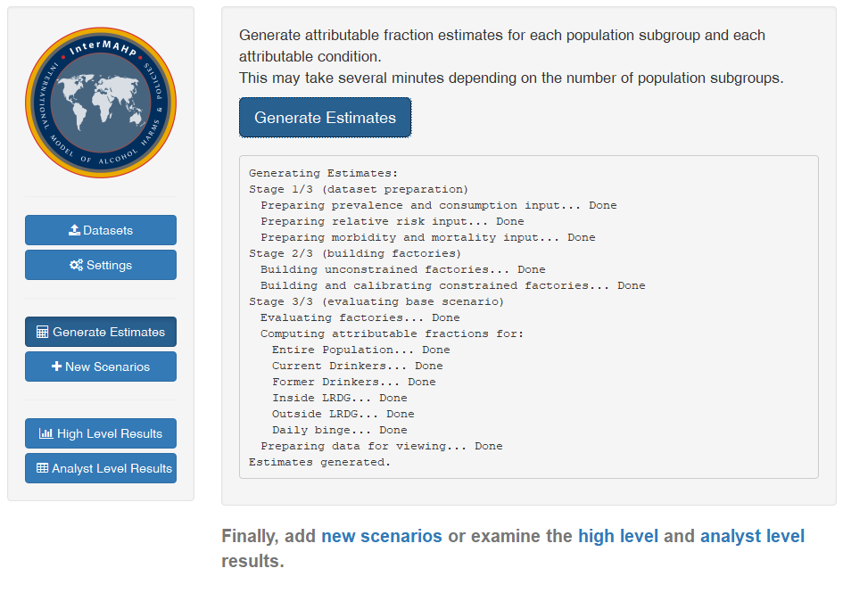
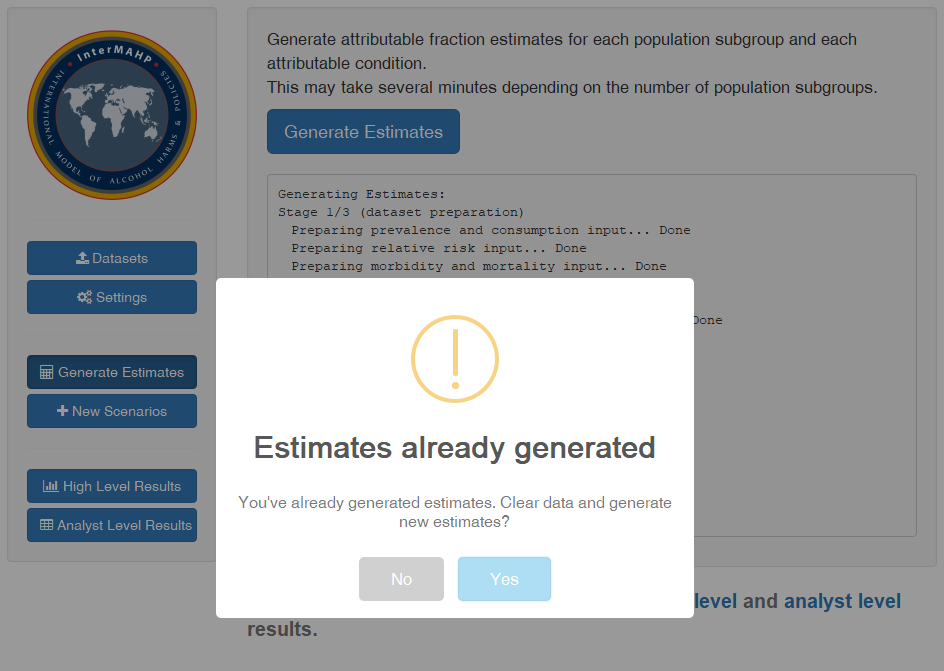
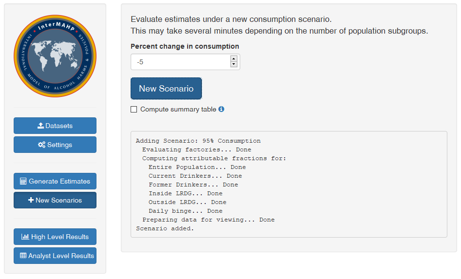
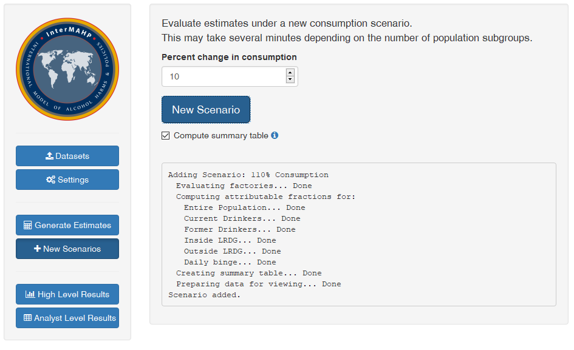
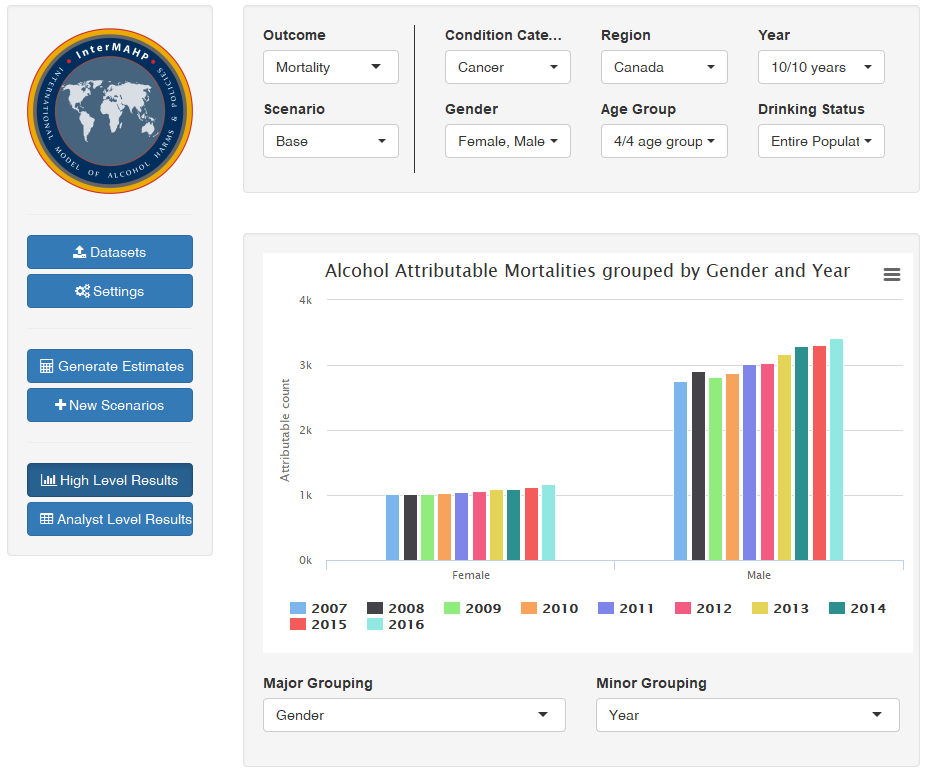
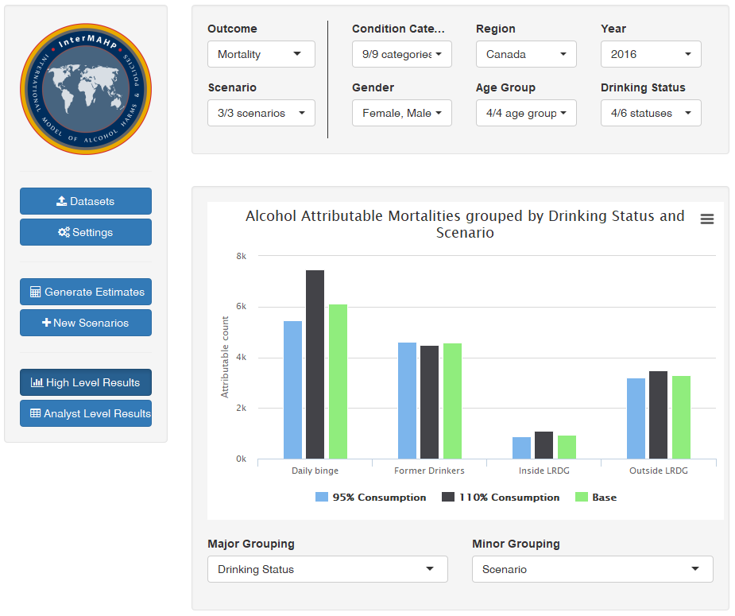
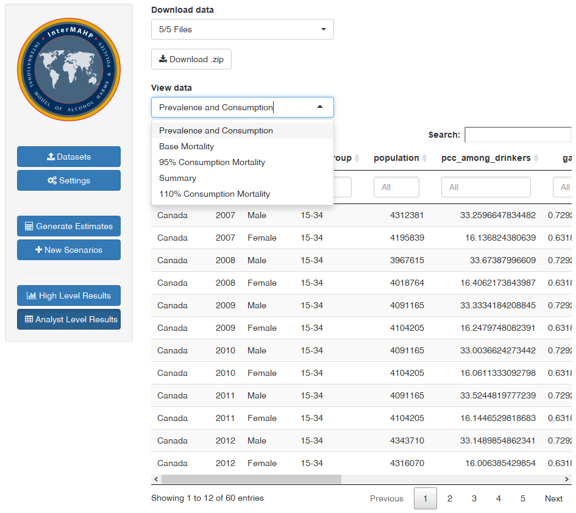

# The International Model of Alcohol Harms and Policies

> *Copyright 2018 Canadian Institute for Substance Use Research. Licensed under the MIT license.*

This RStudio Shiny app provides an interface to the International Model of Alcohol Harms and Policies (InterMAHP), an R package used to compute Alcohol Attributable Fractions (AAFs), explore change in alcohol consumption scenarios, visualize the results, and download relevant computed statistics in .csv format.  Users provide statistics on drinking prevalence, average alcohol consumption, and total deaths and/or hospitalizations in their region.  A customizable table used to generate condition-specific relative risk curves is also provided. InterMAHP is [available online](https://cisur.shinyapps.io/intermahp), or it can be [run locally](#r-interactive).

This document serves as a tutorial for the app, and complements the guides found on [InterMAHP's homepage](https://www.uvic.ca/research/centres/cisur/projects/intermahp/index.php) at the Canadian Institute for Substance Use Research.

Table of contents
=================
-   [Background](#background)
-   [Overview](#overview)
-   [Running InterMAHP locally](#running-intermahp-locally)
-   [Running InterMAHP remotely](#running-intermahp-remotely)
-   [Using InterMAHP](#using-intermahp)
    -   [Quick start](#quick-start)
    -   [Using your own data](#using-your-own-data)
        -   [Prevalence and consumption](#prevalence-and-consumption)
        -   [Morbidity and mortality](#morbidity-and-mortality)
        -   [Relative risk](#relative-risk)
        -   [Relative risk adaptation](#relative-risk-adaptation)
    -   [Advanced settings](#advanced-settings)
        -   [Units of alcohol](#units-of-alcohol)
        -   [Binge limits](#binge-limits)
        -   [Upper limits](#upper-limits)
        -   [Dose extrapolation](#dose-extrapolation)
        -   [Drinking groups](#drinking-groups)
        -   [Quick start settings](#quick-start-settings)
    -   [Analysis](#analysis)
        -   [Generate estimates](#generate-estimates)
        -   [Add new scenarios](#add-new-scenarios)
    -   [Results](#results)
        -   [High level](#high-level)
        -   [Analyst](#analyst-level)
-   [Further reading](#further-reading)
    -   [Comprehensive manual](#comprehensive-manual)
    -   [References](#references)

## Background

## Overview

InterMAHP allows customization of relative risk curves, drinking status specification, and models changes in consumption to generate estimates of harms in a given population.  Results are available in a variety of forms: customizable downloadable charts, summary statistic tables, and full morbidity and mortality attributable fraction tables.

## Running InterMAHP locally

InterMAHP depends on two packages available through github.  The easiest way to install these is through the `devtools` package, available on CRAN.  You'll need `intermahpr`, the InterMAHP backend:
```sh
devtools::install_github("uvic-cisur/intermahpr")
```
and rCharts:
```sh
devtools::install_github("ramnathv/rCharts")
```

The remaining packages, available through CRAN, are
```
shiny
shinyjs
shinyWidgets
shinyalert
dplyr
purrr
tidyr
magrittr
gtools
DT
```

<!---
TODO:: Include a script that installs all necessary packages.

TODO:: Standalone executable.
--->

The easiest way to run InterMAHP locally is through the RStudio 'Run App' button, but you may also execute the command
```sh
shiny::runApp(launch.browser=TRUE)
```
in the directory containing this repository from a base R installation.

## Running InterMAHP remotely

InterMAHP is also hosted at [https://cisur.shinyapps.io/intermahp](https://cisur.shinyapps.io/intermahp) for remote access.

## Using InterMAHP

### Quick start

Preloaded datasets are provided to allow a quick exploration of InterMAHP's functionality.  Navigate to the 'Datasets >> Use sample datasets' tab, select desired years of study and ischaemic heart disease treatment, and load the data.  InterMAHP will use Canadian prevalence, consumption, and mortality data for the selected years.

The choice of ischaemic heart disease treatment is a choice of preferred literature. Ischaemic heart disease relative risk is stratified at the meta-analysis level by treatment of abstainer bias. Zhao explicitly controls for abstainer bias by selecting studies with no bias and other methods. Roerecke reweights relative risk results from studies which pooled former and never drinkers as abstainers using a standard methodology.

For more information, refer to the articles themselves:
-   Zhao [\[1\]](#ref-zhao)
-   Roerecke [\[2\]](#ref-roerecke)
    
When the data is loaded, advanced settings may be tinkered with or left alone.  For more information, see the general description of [advanced settings](#advanced-settings) and an [example](#quick-start-settings).

Next, generate estimates and add new scenarios if desired.  This typically takes several seconds per year of sample data.

The 'High level results' tab generates custom charts from the computed statistics.  The 'Analyst level results' tab displays generated datasets and provides a data download link.

### Using your own data

Before using local data, refer to the sample datasheets provided for download under the 'Datasets >> Upload new datasets' tab.  The variable names used in these sample sheets must be the same variable names used in the data you wish to analyze using InterMAHP.

InterMAHP currently only recognizes the values of 'Male' and 'Female' (and, in the relative risk sheet, 'All') under the 'gender' variable for the purposes of generating alcohol consumption density curves and choosing specialized relative risk curves.

#### Prevalence and consumption

The prevalence and consumption data variables provide the data necessary to estimate alcohol exposure among regional populations, stratified by region, year, gender, and age group.  The previous four variables are used to join tables, so ensure that their levels match those found in your morbidity/mortality and relative risk datasets as needed.  The following is a brief description of each variable, and refers to a Region-Year-Gender-Age group as a 'cohort'.

-   <a name = "region">*Region*</a> &ndash; Region is a variable of the prevalence/consumption and morbidity/mortality datasets.
-   <a name = "year">*Year*</a> &ndash; Year is a variable of the prevalence/consumption and morbidity/mortality datasets.
-   <a name = "gender">*Gender*</a> &ndash; Note that the relative risk sheet accepts the additional gender option of 'All', but this option merely duplicates the row over the rest of the gender levels.  Otherwise, genders must match those found in your morbidity/mortality and relative risk datasets. 
-   <a name = "age-group">*Age_group*</a> &ndash; Age group is a variable of the prevalence/consumption and morbidity/mortality datasets.  Because morbidity and mortality data is typically available for persons less than 15 years of age but alcohol consumption data is not, InterMAHP uses the next youngest age group to distribute harm in this age group for conditions wholly attributable to alcohol.  No prevalence/consumption data is needed for this age group; just ensure that sorting your age groups is alphabetical order also sorts them youngest to oldest.  This is achieved, for example, by the age groups "00-14", "15-34", "35-64", "65+".
-   *Population* &ndash; The population of the given cohort.
-   *PCC_litres_year* &ndash; The best estimate of per capita consumption in litres over the entire population within the given region over the given year.  Note that this observation is constant over genders and age groups with the same region and year.  This value is distributed over cohorts using population and relative consumption between cohorts.
-   *Correction_factor* &ndash; Per capita consumption is adjusted by the given correction factor to account for overestimation when producing consumption statistics via recorded + unrecorded consumption as the epidemiological studies that produce relative risk functions are typically subject to per capita consumption undercoverage.  The default value approved by the WHO methodological committee is 0.8 (Source).  For more details see the [comprehensive manual](#comprehensive-manual).
-   *P_LA* &ndash; Prevalence of lifetime abstainers in cohort.  A lifetime abstainer is defined as a person that has never consumed one standard drink.
-   *P_FD* &ndash; Prevelence of former drinkers in cohort.  A former drinker is defined as a person that has consumed at least one standard drink in their lifetime, but has not consumed a standard drink in the past year.
-   *P_CD* &ndash; Prevalence of current drinkers in cohort.  A current drinker is defined as a person that has consumed a standard drink in the past year.  Note that, by definition, P_LA + P_FD + P_CD = 1.00.
-   <a name = "p-bd">*P_BD*</a> &ndash; Prevalence of binge drinkers among cohort.  A binge drinker is defined as a person that has consumed at or above the binge drinking level in the past month.  Binge drinking levels are user defined (see [binge limits](#binge-limits) for more details). 

**Note on prevalence values**: Prevalence values must be presented as proportions rather than percentages, i.e. use 0.50 rather than 50.0 or 50%.

#### Morbidity and mortality

The morbidity and mortality table provides data necessary to calibrate risk for conditions wholly attributable to alcohol and is necessary to display high level results.  The Region, Year, Gender, and Age_group variables are used to join this data with prevalence/consumption data, and the IM and Outcome variables are used to join this table with relative risk data.  This data is regarded as supplementary for analyst level results &mdash; i.e. one may upload a .csv file containing only a header row with the following variables, and InterMAHP will still produce analyst level results.

-   *Region* &ndash; See [above](#region)
-   *Year* &ndash; See [above](#year)
-   *Gender* &ndash; See [above](#gender)
-   *Age_group* &ndash; See [above](#age-group)
-   <a name = "im">*IM*</a> &ndash; InterMAHP condition coding.  A detailed list of condition codes is available in the [comprehensive manual](#comprehensive-manual).  This is needed for matching with relative risk data.
-   *Outcome* &ndash; Either 'Morbidity' or 'Mortality'.  Typically, morbidity data is obtained from hospital records and mortality from national vital statistics agencies.  This is needed for matching with relative risk data.
-   *Count* &ndash; The observed total number of morbidities or mortalities among the specified cohort.

#### Relative risk

An example relative risk table is provided for download, and this table must be adapted for your own application of InterMAHP.  The relative risk table is a list of all conditions, stratified by gender and outcome, that you would like InterMAHP to compute attributable fractions for.

-   *IM* &ndash; See [above](#im).  For display of [high level](#high-level) results, InterMAHP matches IM to condition categories.
-   *Condition* &ndash; Name of alcohol related condition.  This name propagates throughout InterMAHP computations.
-   *Gender* &ndash; See [above](#gender).  Accepts an additional possible value of 'All'.
-   *Outcome* &ndash; One of 'Morbidity', 'Mortality', or 'Combined'.
-   *RR_FD* &ndash; Relative risk for former drinkers as compared to lifetime abstainers.  Stratified by condition, outcome, and gender.
-   *BingeF* &ndash; Binge factor that scales the relative risk curve for binge drinkers.  Different from 1 only for injuries.
-   *Form* &ndash; One of 'FP' (requires b1-b16 variables produced by the fractional polynomial technique in alcohol dose-response meta-analysis), 'Spline' (only for hypertension and female acute pancreatitis), 'Step' (only for HIV), or 'Calibrated' (only for wholly-attributable conditions where morbidity and mortality data is supplied).
-   *Attributability* &ndash; One of 'Wholly' or 'Partially'.  Refers to whether the condition is present in the absence of alcohol.
-   *B1-B16* &ndash; These sixteen variables represent the betas produced b a fractional polynomial technique.  See the [comprehensive manual](#comprehensive-manual) for more detail.

#### Relative risk adaptation

Adapting the provided example relative risk sheet for your own applications is necessary and can introduce significant speed improvements by bypassing unwanted computations.
The first recommended adaptation is to the ischaemic heart disease condition for males.
When a choice of [Roerecke vs. Zhao](#quick-start) treatment of ischaemic heart disease has been made,  remove the two observations for the unwanted treatment, change the IM entry from '(5).(R)' or '(5).(Z)' to '(5).(2)', and change the Condition entry to 'Ischaemic heart disease'.
If InterMAHP is without the above adaptation, it and will provide AAFs for each of Roerecke and Zhao IHD, and computation of summary statistics for [high level results](#high-level) will not include the burden from ischaemic heart disease for males (recall that relative risks and morbidity/mortality are matched using IM codes).

Other useful adaptations include restriction to just morbidity or mortality in the outcome variable, which involves changing 'Combined' entries and removing rows that are specific to the unwanted outcome, removing wholly attributable condition entries when analysis at that level of granularity is not needed, or removing motor vehicle collisions when comprehensive local statistics are available.

### Advanced settings

#### Units of alcohol

Changes the average daily units of alcohol used.
Default setting is 'grams-ethanol', but a selection of country-defined standard drinks are available.
This only changes how the units are displayed when entering other advanced settings; all settings are converted back to grams-ethanol before being sent to the `intermahpr` backend package.

#### Binge limits

Sets the minimum amount that a person must drink in a single drinking event for that event to be considered a binge.
These settings are stratified by the genders entered in the uploaded data sheets, and definitions for binge limits are necessary for surveys that estimate prevalence of binge drinkers [P_BD](#p-bd).

#### Upper limits

Sets the upper limit of daily alcohol consumption.
The default value is set to 250 grams-ethanol, which is informed by Stockwell et al. [\[3\]](#ref-stockwell-2017a), while an upper bound of 150 grams-ethanol is used by WHO in their Global Status Report on Alcohol and Health [\[4\]](#ref-who-gsrah).

#### Dose extrapolation

Changes how fractional polynomial relative risk curves are extrapolated beyond 150 grams-ethanol (100 for ischaemic heart disease).
Such an extrapolation is necessary, as described in the book on the FP technique [\[5\]](#ref-royston-book), because extrapolation of data should not be performed too far outside of the range of that data.

Included extrapolations are capped or linear.
Under capped extrapolation, the continuous relative risk function is simply capped at the value it reaches at 150 g/day (100 for IHD).  It takes this value for all consumption levels above 150 g/day (100 for IHD).
Linear extrapolation has slope calculated between 100 and 150 g/day (50 and 100 for IHD).

#### Drinking groups

Attributable fractions are computed for three groups by default:
-   Current drinkers
-   Former drinkers
-   Entire population

Of these, fractions are only mandatory for 'Entire population' &ndash; the others may be unchecked.

Custom drinking groups, stratified by gender, can also be defined.
Unique, alphanumeric names for each group are required.

#### Quick start settings

The [Canadian low risk drinking guidelines](http://www.ccdus.ca/Eng/topics/alcohol/drinking-guidelines/Pages/default.aspx) recommend that women drink no more than 10 Canadian standard drinks per week, with no more than 15 for men.
These guidelines translate to approximately 1.43 drinks per day on average for women and 2.14 for men.
Furthermore, Canadian surveys define the number of drinks for an event to be classified as binge drinking as 4 for women and 5 for men.

To tailor InterMAHP for the sample Canadian statistics, we set the unit of consumption, binge limits, and implement 'Inside Canadian LRDG', 'Outside Canadian LRDG but less than daily binge', and 'Daily binge' groups.

[](www/global-params.png)

Under the 'Global parameters' tab, change the unit of average daily consumption to 'Canada' and set binge limits to '4' for Female and '5' for Male.

[](www/inside-lrdg.png)

Under the 'Drinking groups' tab, add the group name 'Inside LRDG', click 'Use minimum' to set lower bounds to 0 and enter 1.43 for 'Female lower bound' and 2.14 for 'Male upper bound', then click 'Add new group'.

For 'Outside LRDG', set the Female lower bound to 1.43, upper bound to 4, and set Male lower bound to 2.14, upper bound to 5, and add the group.

For 'Daily binge', set the Female lower bound to 4 and the Male lower bound to 5, and click 'Use maximum' to set the upper bounds to the defined upper limit of consumption.

[](www/all-groups.png)

With advanced settings in place, estimates are ready to be generated.


### Analysis

#### Generate estimates

To generate estimates, press the 'Generate estimates' button.

[](www/generate-estimates.png)

If estimates have already been generated during your session, you will see a warning that old estimates will be deleted and replaced if you continue.

[](www/estimates-already-generated.png)

Estimates are generated by running the uploaded data through several stages of analysis.
Stage 1 is dataset preparation.

Preparation of prevalence and consumption data involves applying population constants set in advanced settings and computing derived metrics such as the shape and scale parameters for the gamma distribution that represents the density of drinkers as a function of average daily grams-ethanol.
For more details of how this distribution affects alcohol attributable fraction computations, see the [comprehensive manual](#comprehensive-manual).

By comparison, there is little preparation for relative risk and morbidity/mortality data.
Preparation of relative risk data involves expanding 'All' and 'Combined' entries over relevent levels, and we also extract data from the B1-B16 variables into a form that is more managable.
For morbidity and mortlaity, we collapse deprecated IM codes that were discontinued after version 1.

Stage 2 is factory building.
The internal structure of InterMAHP involves building a function factory for every condition and outcome across age group, gender, geography, and time.
This factory accepts as input a consumption distribution and outputs an attributable fraction calculator.
Unconstrained factories are those that are determined entirely by the relative risk sheet, i.e. those where the relative risk curve is formally defined.
Constrained factories depend on morbidity and mortality data to produce an absolute risk curve because this technique is only used for conditions that are wholly attributable to alcohol.

Stage 3 is factory evaluation.
When generating initial estimates, the factories are evaluated at baseline consumption, i.e. the consumption levels uploaded in the prevalence and consumption table.
The resulting attributable fraction calculators are then evaluated for every desired drinking group, and then the resulting data is cleaned and prepared for viewing at the [high](#high-level) or [analyst](#analyst-level) level.

#### Add new scenarios

In InterMAHP, a scenario is a *consumption* scenario relative to the observed consumption uploaded as a part of the prevalence and consumption table.
This is implemented by rescaling the PCC_litres_year variable and reassessing the prevalence of bingers by maintaining the proportion of average daily bingers within all bingers.
Factories are then evaluated under the new scenario, and fractions are computed for every drinking group included in the baseline scenario.

[](www/minus-five-scenario.png)

There is an additional table that can be computed, which is the summary table.
The summary table contains attributable fractions and relative attributable fractions for the entire population under each scenario, where a relative AF is the attributable fraction under each consumption scenario relative to the fraction under the baseline scenario.
Relative fractions are a necessity when considering wholly attributable conditions because the attributable fraction under all scenarios is by definition exactly 1.0, but the condition incidence is expected to change under different consumption scenarios.
Because the summary table can be computed whenever a scenario is added to your session, but need only be computed in concert with the final scenario, the option to compute is left unchecked by default.

[](www/plus-ten-scenario-and-summary.png)

### Results

#### High level

Morbidity or mortality counts are required in order to investigate high level results.
The base chart that is served is a simple breakdown of all data by condition category.

[](www/high-init.png)

Above the chart is a collection of filters, and below a choice of grouping variable.
The example Canadian data demonstrates that cancer contributed the greatest cumulative alcohol attributable mortality burden in Canada from 2007 - 2016, so we investigate further.
We filter out all condition categories but cancer, and group by gender then year.

[](www/high-cancer-gender-year.png)

Let's also examine the variables we've added to consideration.
We'll return to all condition categories, filter to only 2016, and group by scenario and drinking status.

[](www/high-2016-status-scenario.png)

And we see a comparison between estimated mortality burdens for each of our defined drinking groups under different consumption scenarios.


#### Analyst level

Raw attributable fraction and scenario adjustment data is available for view and download.
Datasets are available as a .zip package.

[](www/analyst-dropdown.png)

## Further reading

### Comprehensive manual

### References

<a name = "ref-zhao">\[1\]</a> Zhao, Jinhui, Tim Stockwell, Audra Roemer, Timothy Naimi, and Tanya Chikritzhs. "Alcohol consumption and mortality from coronary heart disease: An updated meta-analysis of cohort studies." Journal of studies on alcohol and drugs 78, no. 3 (2017): 375-386. [Scholar search](https://scholar.google.ca/scholar?as_q=Alcohol+Consumption+and+Mortality+From+Coronary+Heart+Disease&as_epq=An+Updated+Meta-Analysis+of+Cohort+Studies&as_oq=&as_eq=&as_occt=any&as_sauthors=Jinhui+Zhao&as_publication=&as_ylo=2017&as_yhi=&hl=en&as_sdt=0%2C5)

<a name = "ref-roerecke">\[2\]</a> Roerecke, Michael, and Jürgen Rehm. "The cardioprotective association of average alcohol consumption and ischaemic heart disease: a systematic review and meta‐analysis." Addiction 107, no. 7 (2012): 1246-1260. [Scholar search](https://scholar.google.ca/scholar?as_q=The+cardioprotective+association+of+average+alcohol+consumption+and+ischaemic+heart+disease%3A+a+systematic+review+and+meta%E2%80%90analysis&as_epq=&as_oq=&as_eq=&as_occt=any&as_sauthors=+Michael+Roerecke&as_publication=&as_ylo=2012&as_yhi=&hl=en&as_sdt=0%2C5)

<a name = "ref-stockwell-2017a">\[3\]</a> Stockwell, Tim, Bernadette Pauly, Clifton Chow, Rebekah A. Erickson, Bonnie Krysowaty, Audra Roemer, Kate Vallance, Ashley Wettlaufer, and Jinhui Zhao. "Does managing the consumption of people with severe alcohol dependence reduce harm? A comparison of participants in six Canadian managed alcohol programs with locally recruited controls." Drug and alcohol review 37 (2018): S159-S166. [Scholar search](https://scholar.google.ca/scholar?hl=en&as_sdt=0%2C5&q=Stockwell%2C+Tim%2C+Bernadette+Pauly%2C+Clifton+Chow%2C+Rebekah+A.+Erickson%2C+Bonnie+Krysowaty%2C+Audra+Roemer%2C+Kate+Vallance%2C+Ashley+Wettlaufer%2C+and+Jinhui+Zhao.+%22Does+managing+the+consumption+of+people+with+severe+alcohol+dependence+reduce+harm%3F+A+comparison+of+participants+in+six+Canadian+managed+alcohol+programs+with+locally+recruited+controls.%22+Drug+and+alcohol+review+37+%282018%29%3A+S159-S166.&btnG=)

<a name = "ref-who-gsrah">\[4\]</a> World Health Organization. Global status report on alcohol and health, 2018. World Health Organization, 2018. [Link](http://www.who.int/substance_abuse/publications/global_alcohol_report/en/)

<a name = "ref-royston-book">\[5\]</a> Royston, Patrick, and Willi Sauerbrei. Multivariable model-building: a pragmatic approach to regression anaylsis based on fractional polynomials for modelling continuous variables. Vol. 777. John Wiley & Sons, 2008.
